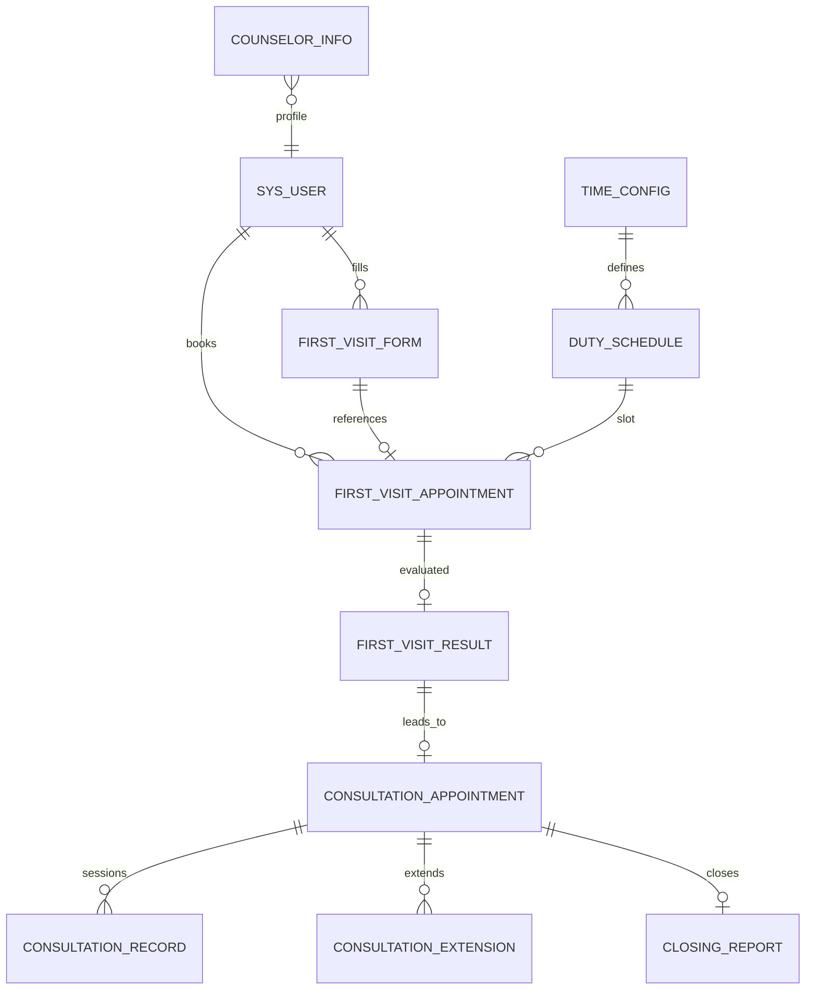

# 数据库 ER 概览

> 完整建表语句见 `sql/init-all.sql`

## 库划分

| 数据库 | 微服务 | 主要表 |
|--------|--------|--------|
| psy_user | user-service | sys_user, counselor_info |
| psy_appointment | appointment-service | time_config, duty_schedule, first_visit_form, first_visit_appointment |
| psy_consultation | consultation-service | first_visit_result, consultation_appointment, consultation_record, consultation_extension, closing_report |
| psy_statistics | statistics-service | closing_report（只读统计） |
| psy_notification | notification-service | sms_log |

## 核心实体关系（简图）

## 业务流程（数据流）

1. **学生** 填写 `first_visit_form` → 提交 `first_visit_appointment`
2. **管理员** 审核预约 → 分配 `visitor_id`（初访员）
3. **初访员** 录入 `first_visit_result`（结论：安排咨询 / 无需咨询 / 转介）
4. **心理助理** 创建 `consultation_appointment`（默认占用 8 周同一时段）
5. **咨询师** 录入 `consultation_record` → 提交 `closing_report`

## 关键字段说明

### first_visit_appointment
- `status`：1待审核 2已通过 3已拒绝 4已撤销
- `is_priority`：优先排队标记

### consultation_appointment
- `occupied_weeks` / `remaining_weeks`：8 周占用与剩余
- `day_of_week`：每周固定星期几
- `status`：1进行中 2已结案 3已脱落

### first_visit_result
- `conclusion`：1无需咨询 2安排咨询 3转介送诊
